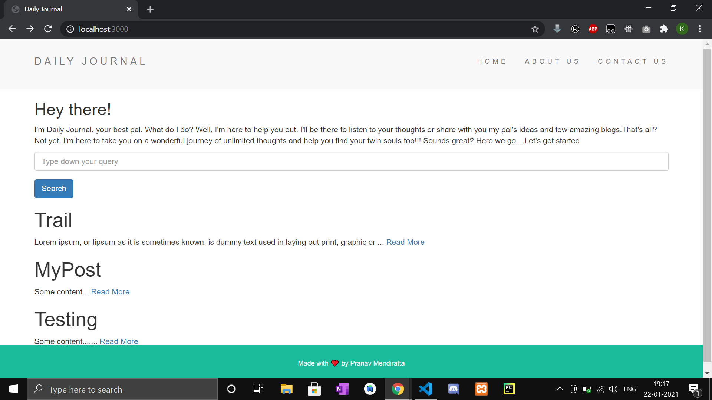
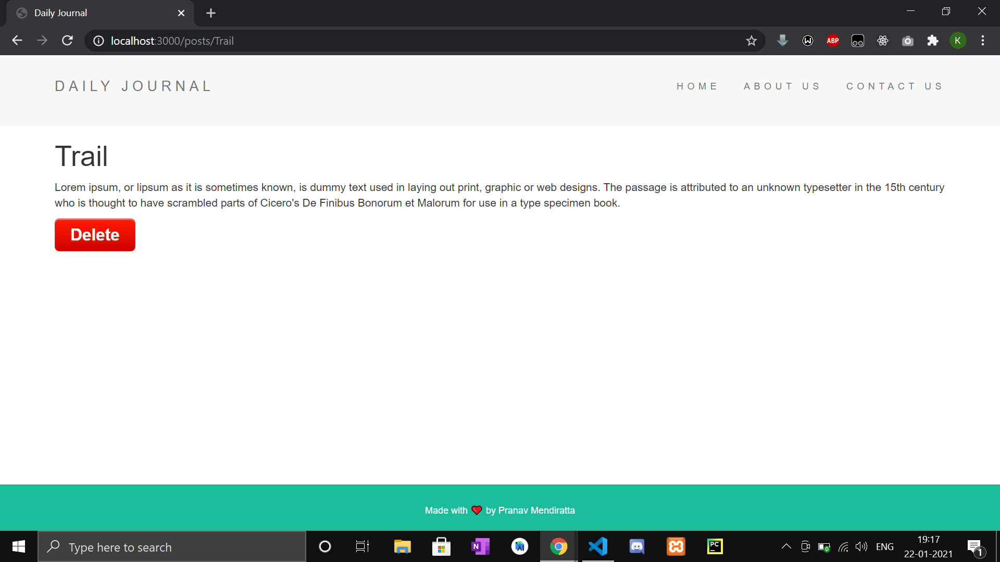
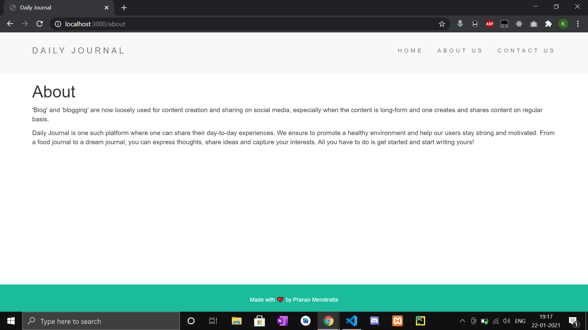
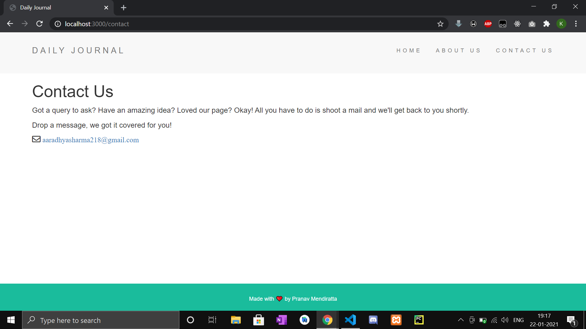

<div align="center">
  <h1>BlogSite</h1>
  
</div>

## About-

<!-- ALL-CONTRIBUTORS-BADGE:START - Do not remove or modify this section -->
[](#contributors-)
<!-- ALL-CONTRIBUTORS-BADGE:END -->

- 'Blog' and 'blogging' are now loosely used for content creation and sharing on social media, especially when the content is long-form and one creates and shares content on regular basis.
<br/>

- This is a dynamically updating Blog posting website developed primarily using Node Js with EJS template engine and Mongoose as ODM(Object Data Modeling library).

## Tech Stack-
- 
- 
- 
- 
- 
- 
- 

## Screenshots -

<div align="center">
  <h3>Home Page</h3>
  
  <hr>
  <h3>Journal Page</h3>
  
  <hr>
  <h3>About Page</h3>
  
  <hr>
  <h3>Contact Page</h3>
  
  <hr>
</div>

## Environment Setup-

* Drop a :star: on the GitHub repository.
<br/>

* Download and install a code/ text editor.
    - Recommended-
        - [Download VS Code](https://code.visualstudio.com/download)
        - [Download Atom](https://atom.io/)
<br/>

* Download [Node Js and npm(Node package manager)](https://nodejs.org/en/) (when you download Node, npm also gets installed by default)
<br/>

* Mongo DB community editition is free and a great software in order to work with MongoDB applications. [Download Mongo DB community editition](https://docs.mongodb.com/manual/administration/install-community/)
<br/>

* Robo 3T is a desktop graphical user interface (GUI) for Mongo DB. It can help to skip running all the Mongo DB commands manually every time we want to access the data. [Download Robo 3T](https://robomongo.org/download) **(optional)**
* ### How to connect to local database while contributing
  * Mongo DB community edition and Node JS required to contribute.
  * Run this command on your terminal/ bash to start the Mongo server on port 27017(default).
  
    ```
    mongod
    ```
    
  * You need to change the URL to 'mongodb://localhost:27017/blogDB'
    ```
    const URL = "mongodb://localhost:27017/blogDB"
    ```
  * Run this command to start the project on local host 3000.

    ```
    node app
    ```
  * Open the link in your browser.
    ```
    http://localhost:3000/
    ```
<br/>

<hr>

## ⭐ Getting Started

* [Contribution guidelines for this project](/CONTRIBUTING.md) which should be followed strictly.
<br/>

* Fork the repository to your github account. 
<br>

* Clone the repository by running command
```
git clone https://github.com/ <your user-name> /BlogSite.git
```
in your git bash.
<br/>

* Run command `cd BlogSite`.
<br/>

* Run this command to install all dependencies for the project.
```
npm install
```
All the current dependencies -
```
  "body-parser": "^1.18.3",
  "ejs": "^2.6.1",
  "express": "^4.16.3",
  "lodash": "^4.17.20",
  "mongoose": "^5.11.9"
```
<br/>

* Run this command to start the project on local host 3000.
```
node app
```

* Open link to view the website in your browser window if it doesn't open automatically.
```
http://localhost:3000/
```
* You can learn more about EJS template engine and its syntax to know how we can use it inside our HTML using the [documentation](https://ejs.co/#docs)
<br/>

* Now you are all set to use this project.

#### Some useful Mongo DB commands if you are using the terminal instead of the GUI-
```
show dbs
use db <db name>
show collections
<db name> .find()
```
<hr>

## 📢  Open Source Program

<div align="center">
  <h1>JWOC</h1>
  
  <p>JWoC ( JGEC Winter of Code) is a program organised by Developers JGEC in collaboration with Sristi 2020 which helps students to plunge into Open Source contribution and get the realm of Software Development.</p>
</div>

## Contributors ✨

Thanks goes to these wonderful people ([emoji key](https://allcontributors.org/docs/en/emoji-key)):

<!-- ALL-CONTRIBUTORS-LIST:START - Do not remove or modify this section -->
<!-- prettier-ignore-start -->
<!-- markdownlint-disable -->
<table>
  <tr>
    <td align="center"><a href="https://www.linkedin.com/in/pranav-mendiratta-89713a173/"><br /><sub><b>Pranav</b></sub></a><br /><a href="https://github.com/ALPHAVIO/BlogSite/commits?author=pranav016" title="Code">💻</a> <a href="#projectManagement-pranav016" title="Project Management">📆</a> <a href="https://github.com/ALPHAVIO/BlogSite/commits?author=pranav016" title="Documentation">📖</a> <a href="#maintenance-pranav016" title="Maintenance">🚧</a> <a href="#mentoring-pranav016" title="Mentoring">🧑‍🏫</a></td>
  </tr>
  <tr>
    <td align="center"><a href="https://kanhaiyalal.000webhostapp.com/Kanhaiya.html"><br /><sub><b>kanhaiya lal</b></sub></a><br /><a href="https://github.com/ALPHAVIO/BlogSite/commits?author=mak-ux" title="Code">💻</a></td>
    <td align="center"><a href="https://github.com/Niveditha18"><br /><sub><b>Niveditha Palli</b></sub></a><br /><a href="#content-Niveditha18" title="Content">🖋</a></td>
    <td align="center"><a href="https://karunkarthik-portfolio.netlify.app/"><br /><sub><b>Karun Karthik</b></sub></a><br /><a href="https://github.com/ALPHAVIO/BlogSite/commits?author=karunkarthik-git" title="Code">💻</a></td>
    <td align="center"><a href="https://indiancovid19tracker.herokuapp.com/"><br /><sub><b>Lucky kumari</b></sub></a><br /><a href="https://github.com/ALPHAVIO/BlogSite/commits?author=luckykumarirai" title="Documentation">📖</a></td>
    <td align="center"><a href="http://sahilsaha.me"><br /><sub><b>Sahil Saha</b></sub></a><br /><a href="https://github.com/ALPHAVIO/BlogSite/commits?author=sahilsaha7773" title="Code">💻</a></td>
    <td align="center"><a href="https://www.linkedin.com/in/anubhab-sarkar-webwriter/"><br /><sub><b>Anubhab Sarkar</b></sub></a><br /><a href="#design-anubhab1710" title="Design">🎨</a></td>
  </tr>
  <tr>
    <td align="center"><a href="https://github.com/uttu2"><br /><sub><b>uttu2</b></sub></a><br /><a href="https://github.com/ALPHAVIO/BlogSite/commits?author=uttu2" title="Documentation">📖</a></td>
    <td align="center"><a href="https://indiancovid19tracker.herokuapp.com/"><br /><sub><b>pankaj kumar bijarniya</b></sub></a><br /><a href="https://github.com/ALPHAVIO/BlogSite/commits?author=pankajkumarbij" title="Documentation">📖</a></td>
  </tr>
</table>

<!-- markdownlint-restore -->
<!-- prettier-ignore-end -->

<!-- ALL-CONTRIBUTORS-LIST:END -->

This project follows the [all-contributors](https://github.com/all-contributors/all-contributors) specification. Contributions of any kind welcome!
